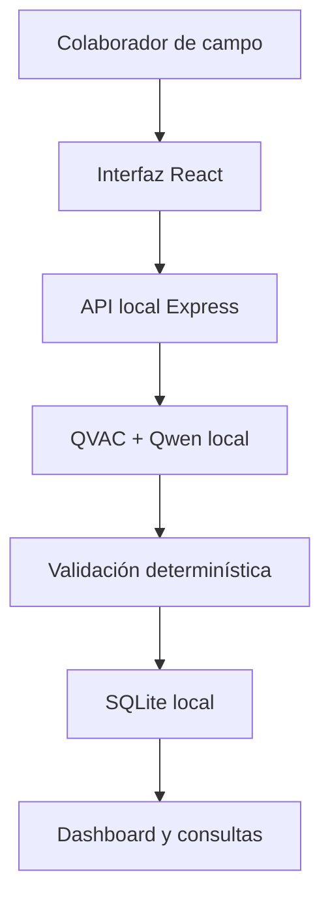

# Cetanex

**Inteligencia local para convertir observaciones de campo en una base instalada médica confiable.**

Cetanex es un prototipo creado para el reto **Customer Installed Base Intelligence**, presentado por Philips. Permite que un colaborador describa en lenguaje natural los equipos observados durante una visita hospitalaria y transforma esa conversación en datos estructurados, consultables y accionables.

La inferencia se ejecuta localmente con QVAC. Las observaciones sensibles no se envían a una API de inteligencia artificial en la nube.

## Problema

Ingenieros, vendedores y especialistas observan diariamente equipos médicos instalados en hospitales y clínicas. Esa información suele permanecer en notas personales, conversaciones o memoria.

Esto provoca:

- Captura manual lenta.
- Información incompleta o inconsistente.
- Observaciones duplicadas.
- Dificultad para conocer la base instalada real.
- Oportunidades de renovación no identificadas.

## Solución

Cetanex convierte una observación como:

> Estoy en Hospital DemoCare Pacific, en Ciudad de Panamá. Vi dos resonadores Philips y un tomógrafo. Uno de los resonadores parece tener unos ocho años.

en registros estructurados independientes:

- 1 resonador Philips, aproximadamente 8 años, estado `Estimado`.
- 1 resonador Philips sin antigüedad confirmada, estado `Reportado`.
- 1 tomógrafo sin marca ni antigüedad confirmadas, estado `Reportado`.

## Funcionalidades

- Captura de observaciones en lenguaje natural.
- Inferencia local mediante QVAC.
- Extracción de cliente, ciudad y país.
- Extracción de modalidad, cantidad, marca, modelo y antigüedad.
- Manejo de información incompleta sin inventar datos.
- Estados de evidencia: `Confirmado`, `Reportado`, `Estimado` y `Desconocido`.
- Pregunta automática sobre el dato faltante más valioso.
- Puntaje de confianza explicable por factores.
- Detección de observaciones duplicadas.
- Almacenamiento local estructurado con SQLite.
- Dashboard con métricas y distribución por modalidad.
- Vista de base instalada por cliente.
- Identificación de oportunidades de renovación.
- Consultas en lenguaje natural sobre el dataset.
- Aplicación determinística de filtros para evitar resultados numéricos inventados.
- Funcionamiento sin inferencia en la nube.

## Arquitectura



### Flujo de procesamiento

1. El usuario escribe una observación.
2. QVAC ejecuta el modelo local Qwen3.
3. El modelo interpreta el lenguaje natural.
4. Cetanex valida, normaliza y separa correctamente los equipos.
5. Se calcula una confianza explicable.
6. El usuario revisa el resultado.
7. La observación se guarda localmente en SQLite.
8. El dashboard se actualiza con información accionable.

## Privacidad por diseño

Cetanex utiliza una arquitectura local-first:

- La inferencia ocurre en el dispositivo.
- No se utiliza una API de IA en la nube.
- SQLite almacena los datos localmente.
- El endpoint `/api/health` expone el estado de la inferencia.
- La respuesta de análisis incluye `processedLocally: true`.
- Después de descargar el modelo por primera vez, este queda almacenado en caché local.

## Tecnología

### Inteligencia artificial

- QVAC SDK `0.19.0`
- QVAC Inference `0.19.0`
- Qwen3 1.7B GGUF Q4
- llama.cpp
- Aceleración GPU en Apple Silicon

### Backend

- Node.js 22
- Express
- SQLite mediante `node:sqlite`
- JSON Repair
- API REST local

### Frontend

- React
- TypeScript
- Vite
- Recharts
- Lucide React
- CSS responsivo

## Estructura

```text
Cetanex/
├── data/                  # Base de datos local, excluida de Git
├── frontend/              # Aplicación React y TypeScript
├── database.js            # Persistencia y consultas SQLite
├── server.js              # API local e integración con QVAC
├── qvac.config.json       # Configuración de QVAC
├── qvac-test.js           # Prueba básica del modelo local
└── README.md
```

## Requisitos

- macOS con Apple Silicon
- Node.js 22 o superior
- npm
- Git
- OpenSSL 3
- Aproximadamente 2 GB libres para dependencias y modelo

## Instalación

Clonar el repositorio e instalar el backend:

```bash
git clone https://github.com/Legolasx0121/Cetanex.git
cd Cetanex
npm install
```

Instalar el frontend:

```bash
cd frontend
npm install
```

## Ejecución

### 1. Iniciar el backend y QVAC

Desde la raíz:

```bash
QVAC_CONFIG_PATH=./qvac.config.json node server.js
```

El backend estará disponible en:

```text
http://localhost:3001
```

La primera ejecución descarga el modelo. Las siguientes utilizan la copia almacenada localmente.

### 2. Iniciar la interfaz

En otra terminal:

```bash
cd frontend
npm run dev
```

Abrir:

```text
http://localhost:5173
```

## Endpoints principales

| Método | Endpoint | Función |
|---|---|---|
| GET | `/api/health` | Estado del backend y la inferencia local |
| POST | `/api/analyze` | Convierte una observación en datos estructurados |
| POST | `/api/observations` | Guarda una observación validada |
| GET | `/api/observations` | Consulta observaciones almacenadas |
| GET | `/api/clients` | Base instalada agrupada por cliente |
| GET | `/api/dashboard` | Métricas y agregaciones |
| POST | `/api/ask` | Consultas en lenguaje natural sobre el dataset |

## Confianza explicable

La confianza no es un número arbitrario. Cetanex calcula el puntaje utilizando:

- Identificación del cliente.
- Completitud de los equipos.
- Calidad de la evidencia.
- Seguimiento de campos faltantes.
- Vigencia de la observación.

Esto permite comprender por qué una observación necesita revisión.

## Consultas confiables

QVAC interpreta la intención de una pregunta y genera filtros estructurados. Después, JavaScript aplica esos filtros directamente sobre los datos locales.

Ejemplo:

> ¿Qué clientes tienen equipos con siete años o más?

Cetanex aplica de forma determinística:

```json
{
  "minimumAge": 7,
  "minimumAgeInclusive": true
}
```

Esta separación entre interpretación y ejecución evita que el modelo invente resultados numéricos.

## Escenario de demostración

1. Mostrar que QVAC está listo y que no existe inferencia en la nube.
2. Crear una observación incompleta en lenguaje natural.
3. Mostrar la extracción de tres equipos independientes.
4. Explicar el estado y el puntaje de confianza.
5. Guardar la observación en SQLite.
6. Mostrar la actualización automática del dashboard.
7. Abrir la base instalada del cliente.
8. Consultar qué clientes tienen equipos con siete años o más.
9. Mostrar la oportunidad de renovación identificada.
10. Repetir la observación para demostrar la detección de duplicados.

## Diferenciadores

- Privacidad hospitalaria mediante inferencia local.
- Funciona con conectividad limitada.
- No inventa valores ausentes.
- Separa observaciones parciales a nivel de equipo.
- Combina IA con validaciones determinísticas.
- Convierte datos incompletos en acciones de seguimiento.
- Ofrece analítica conversacional sin sacrificar exactitud.

## Próximas capacidades

- Dictado de voz completamente local.
- OCR local para placas y etiquetas.
- Sincronización peer-to-peer cifrada.
- Resolución asistida de posibles duplicados.
- Alertas de observaciones antiguas.
- Historial de confirmaciones independientes.
- Firma y trazabilidad de cada actualización.

## Estado

Prototipo funcional desarrollado para el Decentralized AI Hackathon.

- Inferencia local: disponible.
- Persistencia SQLite: disponible.
- Dashboard: disponible.
- Base instalada por cliente: disponible.
- Consultas en lenguaje natural: disponible.
- Detección de duplicados: disponible.
- Oportunidades de renovación: disponible.